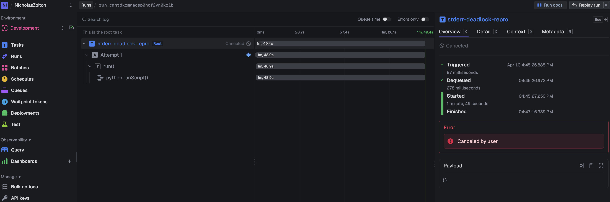

# trigger-python-stderr-repro

Minimal reproduction for a deadlock in `@trigger.dev/python`'s `python.runScript()`.

## The Bug

`python.runScript()` connects the Python subprocess's stderr to a **blocking Unix socketpair** with a ~208KB kernel buffer. If the Python process writes more than ~208KB to stderr, the `write()` syscall blocks permanently in `sock_alloc_send_pskb` because the `trigger-dev-worker` intermediary process does not drain the buffer fast enough.

This is a **silent, permanent hang** — no error, no timeout (unless `maxDuration` is set), no crash.

## Screenshot

The task hangs for the full `maxDuration` (2 minutes) and is then cancelled — `python.runScript()` never returns:



## How to Reproduce

```bash
npm install
npx trigger dev     # or deploy to your Trigger.dev instance
# Trigger the "stderr-deadlock-repro" task from the dashboard
```

The task will hang indefinitely (or until `maxDuration` of 2 minutes is hit). On the runner pod, you can confirm the deadlock:

```bash
# Find the stuck Python process
find /proc -maxdepth 2 -name comm -exec grep -l python {} \; 2>/dev/null

# Confirm it's blocked on a socket write
cat /proc/<PID>/task/*/wchan
# Output: sock_alloc_send_pskb

# Confirm stderr is a blocking Unix socket
ls -la /proc/<PID>/fd/2
# Output: socket:[xxxxx]  (no O_NONBLOCK flag)
```

## Real-World Trigger

In practice, this deadlock occurs when importing heavy Python libraries (`numpy`, `scikit-learn`, `xgboost`, `mlflow`) because:

1. These imports take 30+ seconds and produce log output
2. The parent environment leaks `OTEL_LOG_LEVEL=DEBUG` into the Python subprocess
3. OTEL-aware libraries (like `mlflow`) produce verbose debug logs to stderr
4. The combined output exceeds the 208KB buffer limit

## Workaround

Redirect stderr to `/dev/null` at the start of the Python script:

```python
import os, sys

if os.environ.get("TRIGGER_RUN_ID"):
    devnull_fd = os.open(os.devnull, os.O_WRONLY)
    os.dup2(devnull_fd, 2)
    os.close(devnull_fd)
    sys.stderr = open(2, "w")
```

This fixes the hang but loses all Python log output in the Trigger.dev dashboard.

## Suggested Fix

1. Use **non-blocking sockets** for Python subprocess stdio, or actively drain stderr in a dedicated read loop
2. Don't leak `OTEL_*` / `TRIGGER_*` env vars into `python.runScript()` — either replace the env when `env` is provided, or filter internal vars
